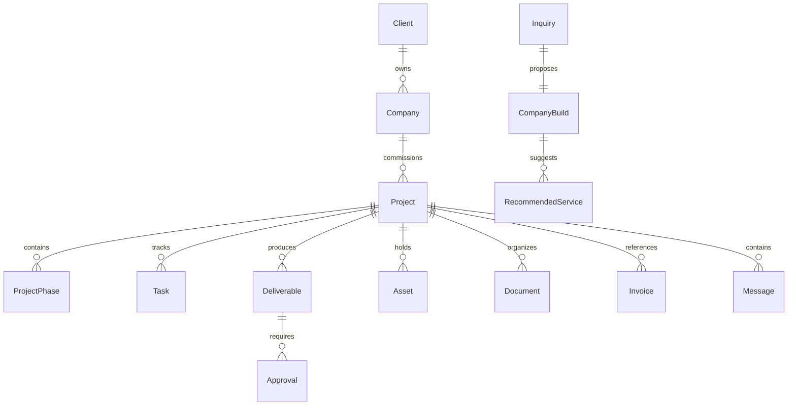

# Dynasty Works Studio — Company Builder architecture

Version 1.2 · 2026-09-15

## Vision

A founder can arrive with an idea, an existing brand, a product, a website or an operating business. Dynasty Works Studio helps coordinate a roadmap through the stages that are relevant:

Idea → Company → Brand → Product → Digital → Launch → Distribution → Activation → Growth.

This is a service and workflow architecture. It does not imply guaranteed formation, licensing, retail placement, customers, fundraising or commercial results.

## Current user journey

1. Enter through the home page or /start-a-business.
2. Choose one of four founder pathways. The page offers deterministic starting suggestions.
3. Enter /start-a-business/builder. Seven steps collect business type, existing milestones, needs, timing preference, budget discussion preference, contact details and a visual summary.
4. Review and edit through Back. Download a local text brief.
5. Start the build shows an explicit not-submitted state. No server persistence or transmission occurs.

An optional pathway query contains only a predefined public pathway ID. An existing tab-session draft takes precedence over a pathway suggestion. Invalid/corrupt drafts are discarded. Resuming an incomplete summary returns to the first incomplete step.

## Practices and journey

Eight practices live in data/practices.ts: Start, Brand, Build, Launch, Distribute, Activate, Grow, Publish.
Eight journey stages live in data/company-builder.ts: Idea, Form, Brand, Build, Launch, Distribute, Activate, Grow.

The operational delivery process (Discover / Define / Design / Develop / Deploy / Evolve) remains distinct: it describes how the studio works within a project, rather than stages of company maturity. The original twelve specialist disciplines remain available under Capabilities.

Future child-route descriptors exist for idea, formation, brand, build, launch and grow. These are not implemented or linked as navigation. The only new live routes are /start-a-business and /start-a-business/builder.

## Recommendation rules

Recommendations are transparent local rules, not AI:

- Existing milestones inform setup, identity, website and ongoing-support suggestions.
- Consumer Brand, Consumer Product, Food / Beverage, Fashion, Beauty, Hospitality and Retail receive physical-market options.
- Other categories, including Technology and E-commerce, can explicitly indicate a physical-product, retail or hospitality component.
- Software-only Technology receives no automatic distribution, sampling or retail recommendations.
- Changing the business type to an ineligible type removes stale market selections while preserving valid core selections.
- Recommendations never auto-select services. The founder chooses the scope.
- Not every client needs every stage.

The Project Inquiry form uses the same market-service vocabulary and asks whether physical products, retail or hospitality are relevant before showing those choices.

## Market entry and retail readiness

The connected framework is Product ready → Sales ready → Distributor ready → Retail ready → Market ready → Activation → Reorder / expansion.

The retail-readiness list is a potential scope, not proof of readiness or certification. Buyer decks, distributor materials, catalogs, pricing sheets, packaging renders and activation plans require client-approved facts. No UPC, certification, license, pricing amount, retail relationship, distributor agreement or regulatory approval is invented.

## Current data boundaries

- data/company-builder.ts: steps, pathway descriptions, business types, needs, eligibility, launch windows, draft budget bands and reusable boundaries.
- data/practices.ts: eight practices and useful cross-service relationships.
- data/offerings.ts: unpublished package/retainer placeholders, engagement levels, template ideas and professional-network categories.
- lib/company-builder.ts: draft parsing, normalization, eligibility, recommendations and validation.
- types/company.ts: lightweight future domain contracts.
- lib/analytics.ts: typed no-op event boundary.
- Existing ContentRepository remains the portfolio/CMS boundary.

### Entity relationships

Contracts cover Client, Company, Project (StudioProject alias), ProjectPhase, Service, Deliverable, Task, Approval, Asset, Document (CompanyDocument alias), Invoice, Message, Template, Inquiry, CompanyInquiry, CompanyBuild, RecommendedService, VerifiedProof, MarketCaseSection and professional-network categories/members. These are not a database migration or a promised API.

## Verified portfolio and trust content

MarketCaseSection supports distribution strategy, retail strategy/placement, distributor development, market activation, sampling, events, retail displays and channel expansion.

A section renders only when status is approved, approvedAt and proofRef exist, and body is nonempty. Existing projects have no such sections and gain no invented results.
TrustEvidence similarly accepts only approved, sourced records. No people, testimonial text, partner names or retail claims are seeded.

These frontend checks support editorial discipline; future backend publication must enforce authorization and review independently. A typed approved field alone is not a security boundary.

## Professional-service boundaries

Formation, EIN, trademark, licensing, permits, tax and regulated activity are positioned as research, administrative assistance where permissible, preparation, workflow support and professional coordination. No legal or tax advice is offered. No law-firm, accounting-firm, government-agency or registered-agent status is implied.

Distribution and activation support is strategy, research, presentation/material development and coordination. Dynasty Works Studio is not represented as a licensed distributor, broker, wholesaler or regulatory professional. Sampling and tastings require appropriate licensed operators, permissions and applicable approvals. Scope, jurisdiction, responsibilities and licensed providers must be verified before execution.

ProfessionalBoundary is reusable and shown where the subject calls for it. Future professional-network records require permission to publish, credential verification where relevant, jurisdiction, engagement scope and periodic review. Categories alone imply no existing partnerships.

## Session state and privacy

The builder stores a versioned draft in sessionStorage for the current browser tab, including contact fields, with visible explanation and a Clear this draft control. It survives reloads but is not account storage or backend persistence. Browser session restoration can retain tab data according to browser behavior; do not promise secure deletion from the device.

No drafts go into URLs, analytics, logs, localStorage or public portfolio data. A browser that refuses sessionStorage can still use the in-memory form and download a copy. Do not enter sensitive formation documents, financial records or unpublished intellectual property in this preview. Future confidential intake belongs behind appropriate authentication and private storage.

## Future backend and portal

Do not add a production schema until tenant, permission, retention and workflow requirements are approved. Future server boundaries:

- validate payloads server-side; cap body/upload size;
- create durable inquiry acceptance before acknowledging success;
- use idempotency and distributed rate limiting;
- add server-verified bot protection and abuse monitoring;
- separate public portfolio DTOs from private client/company/project records;
- require authentication and per-resource authorization;
- enforce row-level security for exposed tables;
- use private object storage and short-lived signed URLs;
- validate MIME/magic bytes, scan uploads and audit access;
- keep service credentials and signing keys server-only.

Proposed /portal remains unimplemented and unlinked. Modules:

- Overview: current phase, evidence-based progress, timeline, next milestone.
- Tasks: studio/client assignments, completed items, approvals.
- Documents: formation, contracts, brand/business files, references.
- Brand vault: approved logos, fonts, colors, guidelines, packaging, photography and templates.
- Project files: sites, apps, creative, videos, documents and source.
- Approval center: approve, request revision, comments, identity and timestamp.
- Financial: provider-backed proposals, invoices, payments, subscriptions and retainers.
- Messages: project-scoped communication with retention and audit rules.
- Launch center: checklist, dependencies, date and final assets.

Role separation should distinguish client owner/member, studio staff/admin and explicitly assigned licensed specialists. Authentication does not itself grant access to another company’s records. Approval history should be immutable or audited. Never derive progress percentages from invented milestones.

## Monetization architecture

Package drafts: Idea to Identity, Company Launch, Brand Build, Digital Build, Full Company Build, Growth Partnership.
Each has service scope, deliverables, optional timeline, starting-price field, intended audience, add-ons and CTA. All are draft; prices and timelines are null, and PackageCard hides them.

Recurring offerings remain draft, with null price and cadence. Engagement levels explain DIY, Done with you and Done for you, while the existing Templates catalog remains a clearly labeled preview with no fake inventory.

Budget-band drafts are internal placeholders with null numeric bounds. The builder shows only a discussion choice and an optional founder-entered range/currency; no quote is calculated.

Commerce stays provider-neutral. Real products require approved formats, licenses, tax/fulfillment decisions, signed payment webhooks and private downloads before checkout.

## Analytics

Typed future events: view_project, view_service, start_company_builder, company_builder_step, complete_company_builder, start_project, submit_inquiry, view_template, contact_click.
The current recordStudioEvent does nothing: no analytics SDK, cookies, IDs, network calls or tracking are enabled. Builder lifecycle calls demonstrate the boundary. A future adapter must be explicitly approved and must reject free text, contact details and private company information. Complete company builder means the brief reaches review; it must never be treated as an accepted submission or a launched company.

## Future automation

Potential later workflows: detect missing milestones, assemble a draft roadmap, flag professional review, route approvals, check asset readiness and identify the next agreed task. Use explicit rules first. AI-assisted recommendations require evaluation, source grounding, permissions and human review for professional or consequential decisions. No AI capability is implemented or claimed now.

## V1.3 implementation update

The 122-service catalog, seven engagement templates, five growth partnerships and deterministic recommendation engine are implemented. See SERVICE-CATALOG.md, PACKAGE-ENGINE.md, RECOMMENDATION-ENGINE.md and COMMERCIAL-ARCHITECTURE.md for the authoritative V1.3 contracts, dependency rules, review boundaries and future CRM interface. Nine possible roadmap phases are distinct from the eight-practice taxonomy; empty phases are omitted.

Privacy change: contact fields, written budget and referral text are memory-only. Prior session drafts are scrubbed on restore; only non-contact choices recover after reload. No payload is transmitted and no pricing is calculated.
